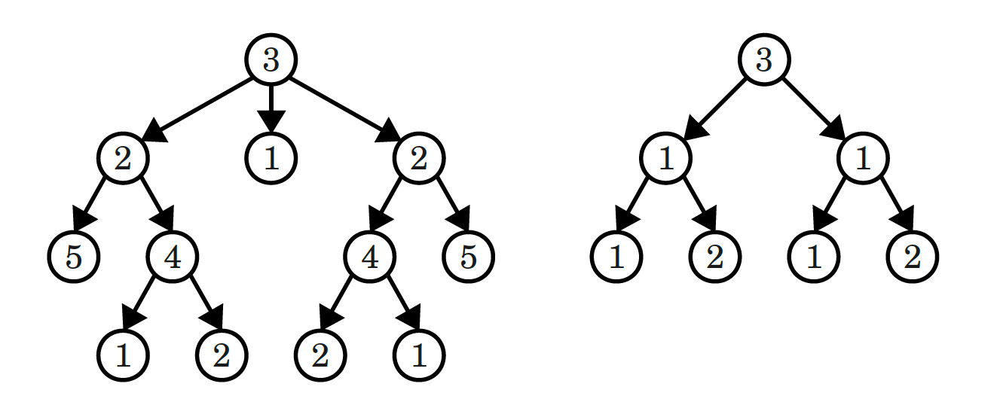

# Find if tree is symmetric

Write a function that determines if a given tree is symmetric.

The function returns true if the tree is symmetric; false otherwise.

The tree on the left is symmetric; the one on the right is not.

