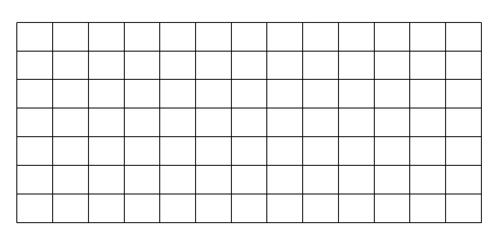

# Warehouse walk

Find all possible paths to reach a target location, in a warehouse, if you can
only make RIGHT or DOWN movements.

The warehouse can be imagined as a rectangular grid.

The warehouse can then be represented as a list of lists; where values in the
'warehouse' represent 'empty' = '1', 'occupied' = 0; think of:

| Value | | Meaning |
| ---: | :---: | :--- |
| 'empty' | --> | 'can-move-in' |
| 'occupied' | --> | 'cannot-move-in' |

Given the following warehouse definition:

`warehouse =  [[1, 1, 1, 0, 0, 1], [0, 1, 1, 1, 1, 1]]`

Find all the paths possible to reach [1, 5] starting from [0, 0].
