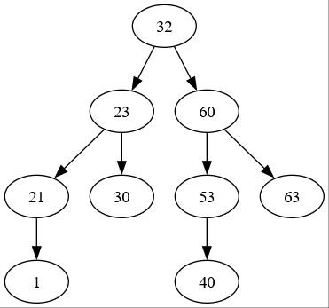
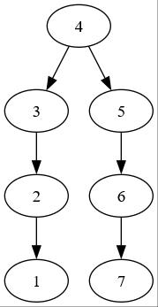

# Is Banary Tree Balanced

A binary tree is balanced if all levels of the tree are filled except the bottom
level. No new level can be started until the bottom level is full.

The following image shows a full balanced tree:

The Following image shows a balanced tree, with the bottom level partially
filled.

And the last image shows an unbalanced tree (regardless that both branches have
the same depth):

Write a function that evaluates if a given tree is balanced or not.
