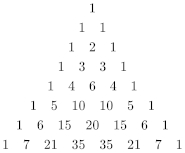

# Pascal's Tirangle

From: [Wikipedia - Pascal's triangle](<https://en.wikipedia.org/wiki/Pascal%27s_triangle>)

> "In mathematics, Pascal's triangle is an infinite triangular array of the
binomial coefficients which play a crucial role in probability theory,
combinatorics, and algebra. In much of the Western world, it is named after the
French mathematician Blaise Pascal, although other mathematicians studied it
centuries before him in Persia, India, China, Germany, and Italy.
>
> The rows of Pascal's triangle are conventionally enumerated starting with row
$n = 0$ at the top (the 0-th row). The entries in each row are numbered from the
left beginning with $k = 0$ and are usually staggered relative to the numbers in
the adjacent rows.
>
> 
>
> The triangle may be constructed in the following manner: In row 0 (the
topmost row), there is a unique nonzero entry 1. Each entry of each subsequent
row is constructed by adding the number above and to the left with the number
above and to the right, treating blank entries as 0.
>
> For example, the initial number of row 1 (or any other row) is 1 (the sum of 0
and 1), whereas the numbers 1 and 3 in row 3 are added to produce the number 4
in row 4."

## The ask

Return the numbers in the k-th row.

| Given | Return |
| :-: | :-: |
| 2 | `[1, 2, 1]` |
| 3 | `[1, 3, 3, 1]` |
| 6 | `[1, 6, 15, 20, 15, 6, 1]` |
| 7 | `[1, 7, 21, 35, 35, 21, 7, 1]` |
